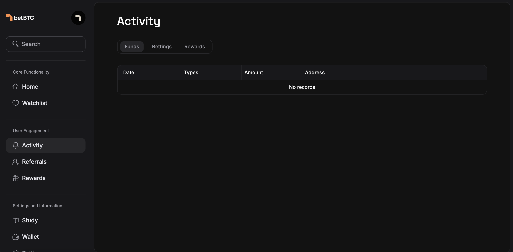

# Actions

The **JSON file** used in STRIKE is a key component for defining actions and interactions with canisters on the Internet Computer. This JSON file contains metadata that defines the structure, appearance, and functionality of the STRIKE component when a user interacts with a canister via a shared URL (such as through Twitter). &#x20;

Below is a detailed breakdown of the JSON format, followed by an explanation of the image provided.

<figure><figcaption><p>Actions</p></figcaption></figure>

### **JSON File Structure**

```json
json{
  "icon": "https://ucarecdn.com/e75cce91-c367-4f74-9ffe-2b6d63398ce1/-/preview/880x864/-/quality/smart/-/format/auto/",
  "label": "Simple ownership",
  "title": "Simple ownership",
  "description": "Demo canister integration with STRIKE",
  "canisterId": "ea6rm-nyaaa-aaaak-ak2wa-cai",
  "links": {
    "actions": [
      {
        "label": "Hello",
        "href": "/1.json"
      },
      {
        "label": "Get owner",
        "href": "/2.json"
      },
      {
        "label": "Set owner",
        "href": "/3.json",
        "parameters": [
          {
            "name": "owner",
            "label": "Enter a new owner"
          }
        ]
      }
    ]
  }
}
```

#### **1. Icon**

* **Field**: `"icon"`
* **Value**: URL of the image that will be displayed in the STRIKE interface as an icon.
* **Example**: `"https://ucarecdn.com/e75cce91-c367-4f74-9ffe-2b6d63398ce1/-/preview/880x864/-/quality/smart/-/format/auto/"`
* **Purpose**: This image will be displayed at the top of the interface. It’s used as a visual representation of the canister or the action.

### **2. Label**

* **Field**: `"label"`
* **Value**: Text that appears below the icon to give a short, identifying name to the action or canister.
* **Example**: `"Simple ownership"`
* **Purpose**: This label is used to indicate the type of action or function that the canister represents.

### **3. Title**

* **Field**: `"title"`
* **Value**: A brief title that gives more information about the purpose of the action.
* **Example**: `"Simple ownership"`
* **Purpose**: The title is used as a headline to summarize the action or canister's functionality.

### **4. Description**

* **Field**: `"description"`
* **Value**: A description that explains the action or purpose of the canister in more detail.
* **Example**: `"Demo canister integration with STRIKE"`
* **Purpose**: This description gives context to the user about the canister and the specific interactions they can perform.

### **5. Canister ID**

* **Field**: `"canisterId"`
* **Value**: A unique identifier for the canister that the JSON file is interacting with. This ID is similar to a smart contract address.
* **Example**: `"ea6rm-nyaaa-aaaak-ak2wa-cai"`
* **Purpose**: The canister ID links the user’s interaction to a specific canister on the Internet Computer, ensuring they are working with the correct contract.

### **6. Links (Actions)**

* **Field**: `"links"`
* **Value**: A set of actions that users can perform with the canister.
*   **Example**:

    ```json
    json{
      "actions": [
        {
          "label": "Hello",
          "href": "/1.json"
        },
        {
          "label": "Get owner",
          "href": "/2.json"
        },
        {
          "label": "Set owner",
          "href": "/3.json",
          "parameters": [
            {
              "name": "owner",
              "label": "Enter a new owner"
            }
          ]
        }
      ]
    }
    ```

    * **Label**: A short name for the action (e.g., "Hello," "Get Owner," "Set Owner").
    * **Href**: The link to the specific JSON file or function related to the action.
    * **Parameters** (for actions like "Set Owner"): Any input required for the action (e.g., a new owner in the "Set Owner" function).
* **Purpose**: This defines the available actions for the user, providing the necessary paths and input fields for interacting with the canister.
